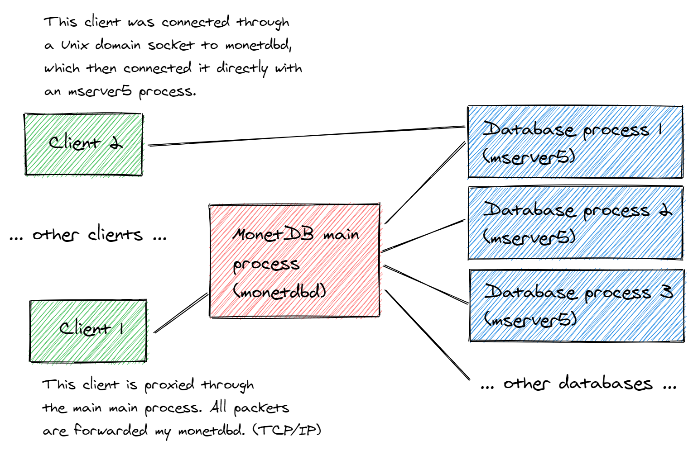
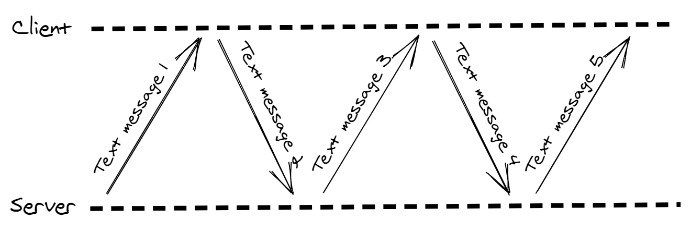
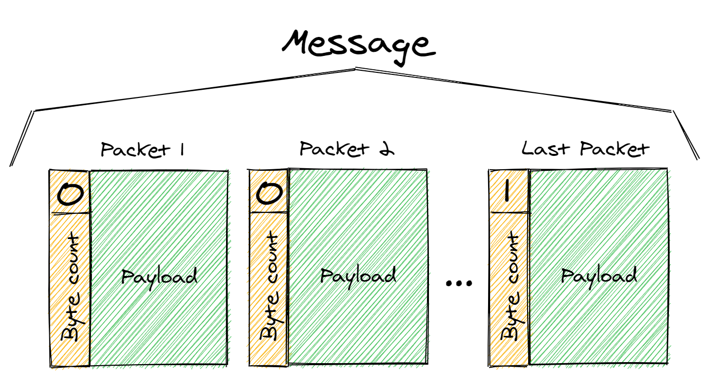
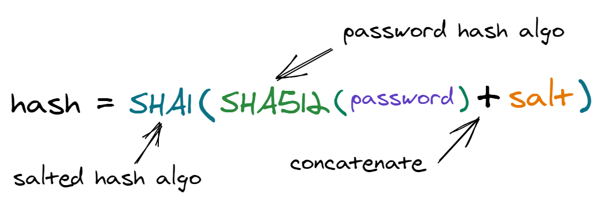
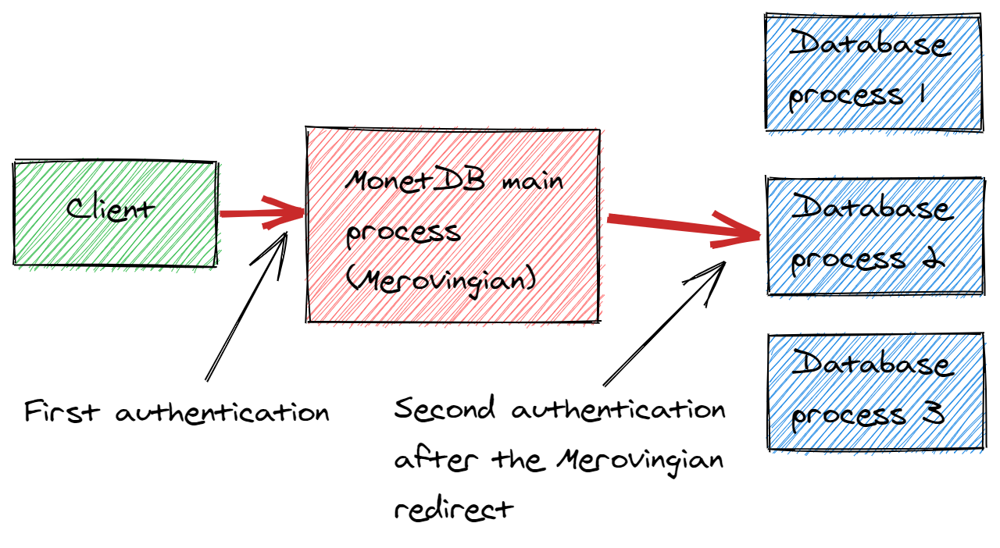
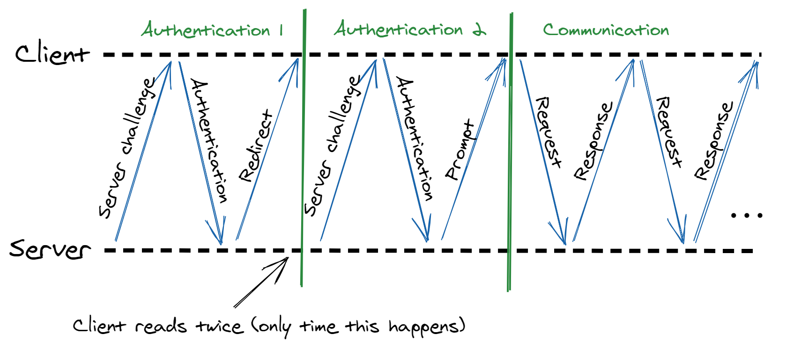
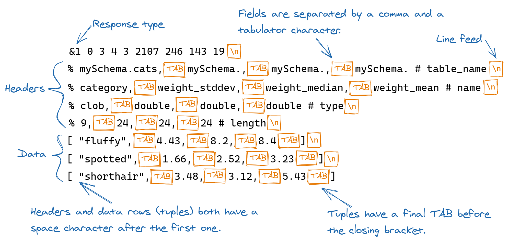
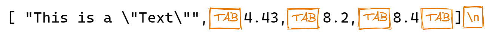

MonetDB client-server protocol (MAPI)
=====================================

*(By Tamas Bolner, 2020-08, reviewed by Sjoerd Mullender)*

This document aims to summarize the key points of the text-based
client-server protocol (version 9) between the MonetDB server and
the clients connecting to it. The goal is to provide information
for the development of future client applications.

# Table of contents

- [MonetDB client-server protocol (MAPI)](#monetdb-client-server-protocol-mapi)
- [Table of contents](#table-of-contents)
- [1. Overview](#1-overview)
- [2. Messages and packets](#2-messages-and-packets)
- [3. Authentication](#3-authentication)
  - [3.1. Possible responses to an authentication request](#31-possible-responses-to-an-authentication-request)
  - [3.2. The Merovingian redirect](#32-the-merovingian-redirect)
- [4. Commands and queries in a nutshell](#4-commands-and-queries-in-a-nutshell)
- [5. Response types](#5-response-types)
  - [5.1. Redirect - **^**](#51-redirect---)
  - [5.2. Query response - **&**](#52-query-response---)
    - [5.2.1. Data response - **&1**](#521-data-response---1)
    - [5.2.2. Modification results - **&2**](#522-modification-results---2)
    - [5.2.3. Stats only (schema query) - **&3**](#523-stats-only-schema-query---3)
    - [5.2.4. Transaction status - **&4**](#524-transaction-status---4)
    - [5.2.5. Prepared statement creation - **&5**](#525-prepared-statement-creation---5)
    - [5.2.6. Block response - **&6**](#526-block-response---6)
  - [5.3. Table header - **%**](#53-table-header---)
  - [5.4. Error - **!**](#54-error---)
  - [5.5. Tuple - **&#91;**](#55-tuple---)
  - [5.6. Prompt message](#56-prompt-message)
- [6. SQL queries](#6-sql-queries)
  - [6.1. Escaping](#61-escaping)
  - [6.2. The tabular format of the data response](#62-the-tabular-format-of-the-data-response)
  - [6.3. Pagination](#63-pagination)
  - [6.4. Multiple queries in a single message](#64-multiple-queries-in-a-single-message)
- [7. Prepared statements](#7-prepared-statements)

# 1. Overview

MonetDB has a main process `monetdbd`, which listens on port 50000 by default for
incoming connections. Each database runs on separate `mserver5` processes,
started by the main.

If the client application is connecting through a UNIX domain socket, then monetdbd
will try to redirect the connection to mserver5 so that the client then talks directly
to mserver5 and monetdbd is no longer involved.

If the client is connecting through TCP/IP, then by default monetdbd will act
as a proxy, transferring data packages between the client and the mserver5 processs.
But it is possible to receive a redirect message from monetdbd, which asks the
client to connect directly to an mserver5 instance.



# 2. Messages and packets

The client communicates with the server by sending and receiving UTF-8
encoded text messages of one or multiple lines. The EOL character is
`\n` (line feed).

When a connection starts, the first message is sent by the server (it
contains the `server challenge`, which is required for the authentication),
and afterwards the client can always expect a response for its messages to
the server. (Although the response can be an empty message.)



These text messages are transferred in packets. The maximal size of a
packet is 8190 bytes. It is not guaranteed that a packet contains a
proper UTF-8 encoded text, because it's possible that a multi-byte
character is cut in half at the end of its payload.



Therefore the simplest way to parse a message is to concatenate the
payloads of the packets first. You can indirectly limit the size
of the messages received from the server, using the `reply_size` command,
which tells the server the maximal number of database rows, that can be
returned in a message. See chapter [Pagination](#63-pagination) for
more information.

Every packet starts with a 16 bit (2 byte) integer, called header. The LSB
of the header is only 1 for the last packet in the message, and 0 for
all the others. You can get the number of bytes in the payload by shifting
the header by 1 bit to the right (to remove the LSB).

    header: int16

    is_last = header & 1
    byte_count = header >> 1

The header for an empty message contains 0x0001, because:

    (0x0000 << 1) | 0x0001 = 0x0001

If the message contains 4321 bytes, then there's a single packet,
which has the header:

    (0x10E1 << 1) | 0x0001 = 0x21C3

If the message contains 12345 bytes, then there are two packages. The first
contains 8190 bytes, while the second the remaining 4155. The `is_last` bit
is only set for the second:

    (0x1FFE << 1) | 0x0000 = 0x3FFC
    (0x103B << 1) | 0x0001 = 0x2077

As stated before, the client reads first at the beginning of the connection,
then after every message it sent. When reading packets, the client should
first read the 2 bytes of the header, then determine the byte count, and
read the exact number of bytes (if not 0, as empty messages are valid). The
only exception to this flow is when a `Merovingian redirect` happens during
authentication. At that time, the client has to read twice.

# 3. Authentication

The first message is sent by the server and it is called `server challenge`.
An example:

    bDRlm4zbfhxAI23:merovingian:9:PROT10,RIPEMD160,SHA512,SHA384,SHA256,SHA224,SHA1:LIT:SHA512:

The `:` (colon) characters are delimiters for 6 fields:

| Value | Description |
| --- | --- |
| bDRlm4zbfhxAI23 | Random string to be used as salt (randomizer) for the hashing/encryption of the password. |
| merovingian | Type of the endpoint. `merovingian` is the main process, `mserver` is a specific database process. |
| 9 | Protocol version |
| PROT10, RIPEMD160, SHA512, SHA384, SHA256, SHA224, SHA1 | Comma-separated list of protocol options. We will only discuss the hash algorithms, used for the salted hashing. |
| LIT | Possible values are `LIT` and `BIG`. Tells whether the server is in a little endian or big endian environment. |
| SHA512 | The accepted algorithm for the password hashing. |

We will only discuss the hash-based protocols. In a nutshell, the client sends a hash
of the user password to the server, and that responds whether it is correct or not
for a specific user.

The password is hashed twice. First by the (usually stronger) `password hash`, and then by
the `salted hash`. The algorithm used for the salted hashing can be chosen by the client
from the comma separated list offered in the server challenge. It is recommended not to use
the same algorithm for both, because if a vulnerability is found for one of them, then
the other still can provide protection.

If the client selected SHA1 for the salted hashing and the server offered SHA512 for the
password hashing, then the formula for getting the hash string is the following:



Where the hash functions output hexadecimal values. After the client calculated the hash,
it sends it in a message like the following:

    LIT:monetdb:{SHA1}b8cb82cca07f379e25e99262e3b4b70054546136:sql:myDatabase:\n

The `\n` at the end means a line feed character. (It seems to work well without that too,
but mclient puts a newline there.) The line consists of colon-separated
values with the following meanings:

| Value | Description |
| --- | --- |
| LIT | Possible values are `LIT` and `BIG`. Tells whether the client is in a little endian or big endian environment. (This seems to have no effect. The server just ignores it, and uses its own endianness.) |
| monetdb | User name |
| {SHA1}b8cb82cca07f379e25<br>e99262e3b4b70054546136 | This value is composed of two parts. First in curly brackets stands the upper-case name of the chosen hashing algorithm for the salted hashing. Then comes the hash of the password, generated by the above formula.
| sql | The requested query language. |
| myDatabase | The name of the database. |

After the client sent the authentication message, it must read a message from the server.
The next paragraph enumerates the valid responses of the server.

Optionally the client can allow the server the send/receive file
transfer requests to/from the client, by adding a `FILETRANS` at the
end, the following way:

    LIT:monetdb:{SHA1}b8cb82cca07f379e25e99262e3b4b70054546136:sql:myDatabase:FILETRANS:\n

## 3.1. Possible responses to an authentication request

After the client has sent the hashed password to the server, it can receive 4 kinds of responses.

- A "prompt" response if the authentication was successful. See section [Prompt message](#56-prompt-message) for more information.
- An error message if the authentication failed. Example:

        !InvalidCredentialsException:checkCredentials:invalid credentials for user 'monetdb'

    Or:

        !monetdbd: no such database 'myDatabase', please create it first

    Detection: the response starts with an exclamation mark `!`.
    When MonetDB returns an error message, then it also discards all session data,
    including active queries, prepared statements, time zone and other settings.

- A message requesting a Merovingian redirect. See the next paragraph about this case. Example:

        ^mapi:merovingian://proxy?database=myDatabase
    
    Detection: the response starts with the `"^mapi:merovingian:"` string.

- A request for a real redirect. See section [Redirect](#51-redirect---).

## 3.2. The Merovingian redirect

The `Merovingian redirect` is a request for the repetition of the authentication
process. It happens in the existing TCP connection (contrary to a real [Redirect](#51-redirect---)).
No new connections are created. This repetition is
required only because of backward compatibility reasons. The first server challenge and response is
from `monetdbd` (main server process), but it doesn't actually do an authentication, as it has no
access to the databases that store the password hashes. The second authentication is a real one,
which is done by an `mserver5` instance. (See chapter [Redirect](#51-redirect---) for more information on
the response format.)

(Since the first authentication is a fake one, you don't even need to send a proper password
hash in it. And indeed, it has been tested that monetdbd will return a redirect response,
even when you provide an invalid password.)

In practice this means usually only two authentications:



Therefore the flow drawn in paragraph [Messages and packets](#2-messages-and-packets)
is not fully realistic, because at the repetition of the authentication process
the client reads twice.



If the redirect happens more than 10 times, then throw an error in the client application,
because this shows an error on the server side.

# 4. Commands and queries in a nutshell

After a successful authentication, the client can start to send requests to the server
and read the responses. There are 3 main types of requests: Commands, queries and
interactive queries.

- **Commands**: They always start with an upper-case `X`. Can be used to configure properties
    of the current session, or to request the next page of a table response. Examples:<br><br>
    Set the `reply_size` to 200 (See chapter [Pagination](#63-pagination)):

        Xreply_size 200

    Request the rows 400-599 from the query with ID 2 (See chapter [Pagination](#63-pagination)):

        Xexport 2 400 200

- **SQL Queries**: They always start with a lower-case `s` and must end with a `;` semi-colon.
    With SQL queries you can either create, update, modify or delete data, modify the
    database schema, etc. or you can also set session properties, like the time zone.<br><br>
    Configure automatic conversion for date-time values in the current session:

        sSET TIME ZONE INTERVAL '+02:00' HOUR TO MINUTE;
    
    Select the default schema: (Put the name in quotes if it contains upper-case characters.)

        sSET SCHEMA "mySchema";

    Query the contents of a table:

        sSELECT *
        FROM "myTable";

    Notice that the query can contain EOL characters.

- **Interactive SQL queries**: These start with an upper-case `S`. Currently only
    `mclient` uses them. You can send an incomplete SQL query to the server,
    and then it will respond with an `\001\002\n` prompt, which means that it
    needs more data to execute the query. You can either complete it with
    SQL clauses that end in a semi-colon, or you can also send an empty message,
    which here means a "flush" operation, indicating that there are no more data.

# 5. Response types

Responses are messages sent from the server to the client, that answer requests
previously sent by the client. Different kinds of requests trigger different
kinds of responses. The type of a response can be identified by their first
character.

| First character | Name | Description |
| --- | --- | --- |
| **^** (caret) | Redirect | Used during authentication only, to indicate a [Merovingian redirect](#32-the-merovingian-redirect). |
| **&** (ampersand) | Query response | A response to an SQL query or to an export command. |
| **%** (percent) | Table header | When tabular data is returned (mostly for a select query), then there are 4 header lines which come before the tuples and tell information about the columns. |
| **!** (exclamation  mark) | Error | The response is an error message. |
| **[** (bracket) | Tuple | Contains tuples, a row of a tabular data set. |

In addition to these, a valid response is also the `prompt message`. See chapter
[Prompt message](#56-prompt-message) for more information.

Each message type can return different kinds of information in different formats.
The next chapters will discuss these formats in detail. The first line of each
response consists of multiple fields. New fields can be added in the future,
therefore it is recommended to ignore the extra ones, and only throw an error
if the field count is less than expected.

## 5.1. Redirect - **^**

Redirect messages always start with the `^` (caret) character.
This can be a real redirect, which instructs the client to close the current
connection and open another one on a specific host/port. Example:

    ^mapi:monetdb://localhost:50001/test?lang=sql&user=monetdb

| Sample value | Description |
| --- | --- |
| ^mapi:monetdb:// | This prefix identifies the redirect type |
| localhost | Host name or IP address. (It can be IPv6) |
| 50001 | Port. |
| test | Database name. |
| sql | Query language to request during the authentication. |
| monetdb | User name to specify during the authentication. |

Or it can mean a [Merovingian redirect](#32-the-merovingian-redirect). Example:

    ^mapi:merovingian://proxy?database=myDatabase

## 5.2. Query response - **&**

A response to an SQL query or to an export command. This type has multiple sub-types.
While the ampersand (&) character is the first, it is followed by a number from
1 to 6, which tells the sub-type.

### 5.2.1. Data response - **&1**

This is a response for a select query. For example let's see the response for query:
(Don't forget that all queries have to start with an `s` character and end with a semi-colon `;`.)

    sselect
        "category",
        round(sys.stddev_samp("weight_kg"), 2) as "weight_stddev",
        round(sys.median("weight_kg"), 2) as "weight_median",
        round(avg("weight_kg"), 2) as "weight_mean"
    from
        "cats"
    group by
        "category";

The first row of the response tells with the `&1` beginning that this is a data response to a query.
The `&1` is followed by a list of space-separated values, which will be discussed in detail below.
After the first line come 4 (or 5, se below) header lines and then the data rows.



The first line contains 9 fields:

| Index | Sample value | Description |
| --- | --- | --- |
| 0 | &1 | Identifies the response type. (data response to a query) |
| 1 | 0 | Result ID. Can be used later to reference the result set in the same session. For example in an `export` command. |
| 2 | 3 | Number of rows in the full result set. This includes those which didn't fit into this message. |
| 3 | 4 | Column count |
| 4 | 3 | Number of rows in this message only. |
| 5 | 2107 | Query ID. A global ID which is also used in functions such as sys.querylog_catalog(). |
| 6 | 246 | Query time in microseconds. |
| 7 | 143 | MAL optimizer time in microseconds. |
| 8 | 19 | SQL optimizer time in microseconds. |

The 4 (or 5, se below) header lines describe the columns of the response. Each line ends with the name of the header.
Use the header names to identify them, don't depend on the order.

| Order | Header name | Description |
| --- | --- | --- |
| 1 | table_name | If the value is from a reference to a table's field, then this contains the name of the table. Otherwise if the value is a result of an expression, then it contains the name of a temporary resource. |
| 2 | name | The name of the column. |
| 3 | type | The SQL type of the column. |
| 4 | length | This length value can help displaying the table in a console window. (Fixed-length character display) |
| 5 | typesizes | Optional. Only returned if enabled by the command `Xsizeheader 1`. Contains the scale and precision (two space separated values) for the types of the columns. Currently used only by the ODBC driver. |

Since the string values in the tuples contain escaped values (like `"\t"`), you can freely split or scan through the rows
by looking for tabulator characters or for their combinations with the commas.

### 5.2.2. Modification results - **&2**

Reponse for `INSERT` or `UPDATE` queries. Example:

    &2 15 -1 2113 439 1596 234

It is a single line, without additional lines, composed of 7 space-separated values:

| Index | Sample value | Description |
| --- | --- | --- |
| 0 | &2 | Identifies the response type. (Data modification result) |
| 1 | 15 | Number of affected or inserted rows. |
| 2 | -1 | Last auto-increment ID for an insert statement. (Or -1 if none) |
| 3 | 2113 | Query ID. A global ID which is also used in functions such as sys.querylog_catalog(). |
| 4 | 439 | Query time in microseconds. |
| 5 | 1596 | MAL optimizer time in microseconds. |
| 6 | 234 | SQL optimizer time in microseconds. |

### 5.2.3. Stats only (schema query) - **&3**

This response is usually returned when a table or a schema is created,
and for statements like `SET TIME ZONE` or `SET SCHEMA`. Example response:

    &3 733 79

A sinlge line of 3 space-separated values:

| Index | Sample value | Description |
| --- | --- | --- |
| 0 | &3 | Identifies the response type. (Stats only) |
| 1 | 733 | Query time in microseconds. |
| 2 | 79 | MAL optimizer time in microseconds. |

### 5.2.4. Transaction status - **&4**

Returned after SQL statements that deal with transactions, like:
`START TRANSACTION`, `COMMIT`, `ROLLBACK`. It tells whether the current session
is now in auto-commit state or not. Example response:

    &4 f

A sinlge line of 2 space-separated values:

| Index | Sample value | Description |
| --- | --- | --- |
| 0 | &4 | Identifies the response type. (Transaction status) |
| 1 | f | Boolean value. `f` = auto-commit mode is disabled (a transaction is started). `t` = auto-commit mode is enabled, there's no active transaction. |

### 5.2.5. Prepared statement creation - **&5**

This response is returned for an SQL query which creates a prepared statement. Example query:

    sPREPARE select name, birth_date, weight_kg from cats where weight_kg > ?;

The response is very similar to the [Data response](#521-data-response---1). But here the
data rows contain information about the types and limits of not just the placeholders
used in the query, but also of the table columns involved:

    &5 15 4 6 4
    % .prepare,     .prepare,       .prepare,       .prepare,       .prepare,       .prepare # table_name
    % type, digits, scale,  schema, table,  column # name
    % varchar,      int,    int,    str,    str,    str # type
    % 7,    1,      1,      0,      4,      10 # length
    [ "clob",       0,      0,      "",     "cats", "name"  ]
    [ "date",       0,      0,      "",     "cats", "birth_date"    ]
    [ "decimal",    8,      2,      "",     "cats", "weight_kg"     ]
    [ "decimal",    8,      2,      NULL,   NULL,   NULL    ]

The first line of the response consists of 5 space-separated values:

| Index | Sample value | Description |
| --- | --- | --- |
| 0 | &5 | Identifies the response type. (Prepared statement creation) |
| 1 | 15 | The ID of the created prepared statement. This can be used in an `EXECUTE` statement. |
| 2 | 4 | Total row count in the result set. |
| 3 | 6 | Column count |
| 4 | 4 | Row count in current response only. |

The original query requested only 3 columns, but this response returned 4 data rows, as the
last one is for the `?` placeholder. The additional type information of the
placeholders is not really required if you implement a library for a typed
language. Because than you can just ask the users to always pass the
parameters in their proper types, otherwise prepare for an error message.

### 5.2.6. Block response - **&6**

Returned for an `EXPORT` command. See chapter [Pagination](#63-pagination) for more information.
It's similar to the [Data response](#521-data-response---1), but there are no header lines,
only the tuples. Example response:

    &6 2 11 200 600
    [ ...,\t...,\t...,\t...\t]
    [ ...,\t...,\t...,\t...\t]
    ...

The first line of the response consists of 5 space-separated values:

| Index | Sample value | Description |
| --- | --- | --- |
| 0 | &6 | Identifies the response type. (Block response) |
| 1 | 2 | Result ID. This ID was referenced in the export command too. |
| 2 | 11 | Column count |
| 3 | 200 | Number of rows in this current response. (not total) |
| 4 | 600 | The offset (index) of the first row in the response. |

Fields 3 and 4 are actually the two parameters of the export command.

## 5.3. Table header - **%**

A line that contains information about the columns of a tabular data response.
Discussed in chapter [Data response](#521-data-response---1).

## 5.4. Error - **!**

Error responses start with an exclamation mark `!`, followed by an error code, then a text
message after a second exclamation mark. When the server returns an error message,
then it clears the complete session state (forgets everything, including prepared
statements and active queries).

Examples:

    !42S02!SELECT: no such table 'notexists'

    !42000!syntax error, unexpected IDENT in: "

The error message sometimes contains no error code:

    !InvalidCredentialsException:checkCredentials:invalid credentials for user 'monetdb'

## 5.5. Tuple - **&#91;**

A line that contains tabular data. Discussed in chapter [Data response](#521-data-response---1).

## 5.6. Prompt message

It is returned for a successful authentication request and in some special
cases. See chapter: [Authentication](#3-authentication)

There are 4 kinds of prompts:

- `Empty message`: consists only of the 2-byte header, containing the value: 0x0001, without any payload.
    This is returned for successful authentication.
- `\001\001\n`: This is an alternative for the "empty message", but the server never sends it in the current version.
- `\001\002\n`: This means the server needs more data to complete the SQL
    query. The response from the client would be either more data or a
    "flush" (empty message) to indicate there is no more.
    Used only in Interactive SQL queries.
- `\001\003\n`: If the client has indicated during initial connection negotiation that
    it can deal with reading/writing files on behalf of the server (`COPY
    INTO table FROM 'some file' ON CLIENT` - currently only implemented in
    mclient) then the server could send a prompt "\001\003\n" which is
    followed by the request the server would like to put to the client:
    - `r offset file`: Read text file with offset.
    - `rb file`: Read binary file.
    - `w file`: Write text file.

# 6. SQL queries

As it was mentioned already in section [Commands and queries in a nutshell](#4-commands-and-queries-in-a-nutshell),
query requests always start with a lower-case `s` letter, and the SQL statements end with a semi-colon `;`.
For example:

        sSELECT *
        FROM myTable;

SQL statements can freely contain newline and other white-space characters.
The possible responses are discussed in section [Query response](#52-query-response---).
See the following sub-sections for additional information on query-related topics.

## 6.1. Escaping

Escaping is required for safely transferring text values between the client and the server,
without breaking the container format. It happens in both directions:

- The server returns the data in a tabular format discussed in section
    [The tabular format of the data response](#62-the-tabular-format-of-the-data-response).
    All the text values inside it are required to be escaped, because any tabulator, newline
    or double-quote character could break the parser of the client application. Example
    data tuple response with escaping:

    

    The client application will have to unescape all escape sequences it finds.

- The client is also required to send all text values inside the SQL queries in an
    escaped form. But in this case breaking the container format is not the only reason
    for doing so. Security considerations also play a huge role. Namely: To avoid
    [SQL injection](https://en.wikipedia.org/wiki/SQL_injection) attacks against the client application.
    Example SQL query with escaping:

    ```sql
    insert into
        "cats"
        ("name", "weight_kg", "category", "birth_date", "net_worth_usd")
    values
        ('D\'artagnan', 8.2, 'fluffy', '2012-04-23', 2340000)
    ```

In theory the above 2 cases can be implemented with different escaping/unescaping
mappings, because for example one needs to escape double quotes, while the other
single ones. Data response rows require tabulator and newline characters to be escaped,
while these won't cause any problems in a query.

But for the sake of simplicity it is common to use a single mapping that contains
all special characters, i.e. to use a single function for both purposes:

| Character | Unicode | Escape sequence |
| --- | --- | --- |
| Single quote (Apostrophe) | U+0027 | `\'` |
| Double quote | U+0022 | `\"` |
| Tabulator | U+0009 | `\t` |
| Carriage return | U+000D | `\r` |
| Line feed | U+000A | `\n` |
| Form feed | U+000C | `\f` |
| Null character | U+0000 | `\000` |
| All non-printable characters from the ASCII range | - | `\...` |

The `\...` stands for a back-slash, followed by 3 octal (0-7) digits.
The unicode code of the character in octal.
For example: `\011`, `\035`, `\240`.

Notice that `\000` is used, instead of `\0`. A single octal value can fail if
it is followed by numbers in the text, for example: "1234`\0`567". Which can
be interpreted as "1234`\056`7". Therefore always use 3 digits for octal
codes. Also note that, while the null character is part of the unicode
standard, MonetDB will interpret it as the end of the string. Probably because
it uses old C-style functions.

## 6.2. The tabular format of the data response

The fields of the first line of the data response and the header rows are
discussed in chapter [Data response](#521-data-response---1), also showing the following
example response:


Here we discuss a method for parsing a single data line:

- The data lines can be detected by their leading `[` (open bracket) character. It is presumed that the lines are iterated through in a way that they don't contain the line feed (`\n`) character.
- The frist and last 2 characters (`"[ "`, `"\t]"`) have to be ignored.
- Notice that all strings in the row are escaped in the [already defined way](#61-escaping). Therefore the only TAB characters that remain are the field separators. You can either search for them or split the string by the comma/tab combination.
- You can know the types of the columns from the header rows, although this isn't always required. (See chapter [Data response](#521-data-response---1))
- If a field value starts and ends with double quotes, then it is a string. To get the string value, you just have to [unescape](#61-escaping) the contents inside the quotes.
- Boolean values are `true`, `false`. Null value is `null`. These are case-insensitive, and without any quote.

## 6.3. Pagination

Incoming messages can become huge if they contain data rows. Since, because of reasons
discussed in chapter [Messages and packets](#2-messages-and-packets), the simplest way
to parse a response is by first joining all its packets, one can run out of memory quickly.

One way to control the response size would be to use the `LIMIT` SQL clause. But for a
generic client library it is not recommended to do any modifications in the passed SQL
statements. So instead of that, the client-server protocol provides a command that tells
how many data rows should be returned in the [first response](#521-data-response---1):

    Xreply_size 200

Using the `reply_size` command or a `LIMIT` clause are not the same. With `reply_size`
the full data set is rendered and stored on the server, but only chunks of
that data will be returned to the client. While `LIMIT` results in a different query
optimization and execution, and the server won't store a complete result set.

Please see the command format in chapter [Commands and queries in a nutshell](#4-commands-and-queries-in-a-nutshell).

Then for each remaining chunk of data, you need to execute the `export` command. Example
for requesting the rows 400-599 from the result set with ID 2:

    Xexport 2 400 200

The export command will be answered by a [block response](#526-block-response---6), which
has no header lines, but data only.

You can know the number of total rows in the response from the third field (index 2) of
the first line of the [data response](#521-data-response---1).

Data sets are stored on the server side until the client closes the session, or until an error message is returned from the server. There's a command for closing a result set before any of those events by passing only its ID:

    Xclose 2

## 6.4. Multiple queries in a single message

You can send multiple SQL queries in a single message, separated by
semi-colon `;` characters:

    sSET SCHEMA mySchema; update table cats set name='asd';
    insert into myTable (value1, value2) values (1, 2);

Then the response will be a single message, composed of multiple lines:

    &3 733 79
    &2 15 -1 2113 439 1596 234
    &2 1 -1 1232 322 890 150

The requests can even contain multiple select and multiple prepare
queries. Then all those results will be concatenated in the
response, honoring the `export_size` per query.

# 7. Prepared statements

For client libraries it is often advised to use parameterized queries
in order to pass string values safely. When escaping is done manually,
a single forgotten escaping is enough to enable SQL injection attacks.
Like in this PHP example:

```php
$escapedValue = $connection->Escape($input1);
$forgotEscaping = $input2;

$connection->Query("
    update
        myTable
    set
        value1 = '$escapedValue'
    where
        value2 = '$forgotEscaping'
");
```

But when using a parameterized query it isn't possible to forget
about it, as it is done automatically. See the following PHP example:

```php
$connection->Query("
    update
        myTable
    set
        value1 = ?
    where
        value2 = ?
", [
    $input1, $input2
]);
```

The only type of parameterized query supported by MonetDB is
prepared statement. Prepared statements are compiled only
when created, and identified by a number (ID).

For each parameterized value you have to provide a `?` (question
mark) placeholder. The creation is done using the `PREPARE` SQL
statement.

    sPREPARE
    update
        myTable
    set
        value1 = ?
    where
        value2 = ?;

The response format is discussed in section [Prepared statement creation](#525-prepared-statement-creation---5).
Example response:

    &5 15 5 6 5

The second value (above `15`) is the ID of the created prepared statement. You
can use that ID in an `EXECUTE` statement, which executes the prepared
statement with the specified parameters. Example:

    sEXECUTE 15 ('First\'Value', 'Second\"Value');

Please note that all values passed to the execute statement are type sensitive.
You cannot pass numbers or true/false values as strings, but they have to be
passed without quotes, example:

    sEXECUTE 16 ('2020-08-12', true, false, null, 3.141592653589, 'another string');

All string values need to be escaped as discussed in chapter [Escaping](#61-escaping).
Date values are also passed as strings.

It is important that when an [error message](#54-error---) is returned, all session data are discarded. Which includes the prepared statements.

When you don't need a prepared statement anymore, you can release it with the following command, passing its ID:

    Xrelease 15
