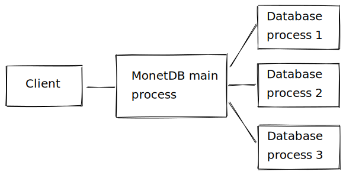
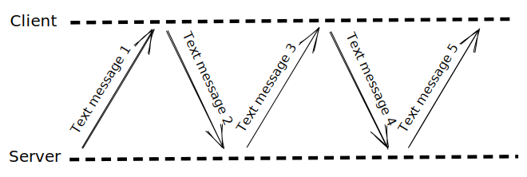
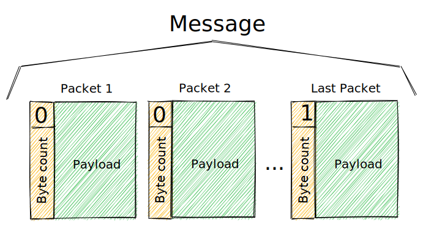

MonetDB client-server protocol
==============================

This document aims to summarize the key points of the TCP/IP-based
client-server protocol between the MonetDB server and the clients
connecting to it.

# 1. Overview

MonetDB has a main process, which usually listens on port 50000 for
incoming connections. Each database runs on separate processes, spawned
by the main. The client application connects only to the main process
directly, which acts as a proxy and transfers the data packages in both
directions between the client and the database it is connected to.



# 2. Messages and packets

The client communicates with the server by sending and receiving UTF-8
encoded text messages of one or multiple lines. The EOL character is
`\n` (line feed).

When a connection starts, the first message is sent by the server (it
contains the `server challenge`, which is required for the authentication),
and afterwards the client can always expect a response for its messages to
the server. (Although the response can be an empty message.)



These text messages are transferred in packets. The maximal size of a
packet is 8190 bytes. It is not guaranteed that a packet contains a
proper UTF-8 encoded text, because it's possible that a multi-byte
character is cut in half at the end of its payload.



Therefore the simplest way to parse a message is to concatenate the
payloads of the packets first. You can indirectly limit the size
of the messages received from the server, using the `reply_size` command,
which tells the server the maximal number of database rows, that can be
returned in a message. (= pagination)

Every packet starts with a 16 bit (2 byte) integer, called header. The LSB
of the header is only 1 for the last packet in the message, and 0 for
all the others. You can get the number of bytes in the payload by shifting
the header by 1 bit to the right (to remove the LSB).

```
header: int16

is_last = header & 1
byte_count = header >> 1
```

As stated before, the client reads first at the beginning of the connection,
then after every message it sent. When reading packets, the client should
first read the 2 bytes of the header, then determine the byte count, and
read the exact number of bytes (if not 0, as empty messages are valid).

# 3. Authentication

