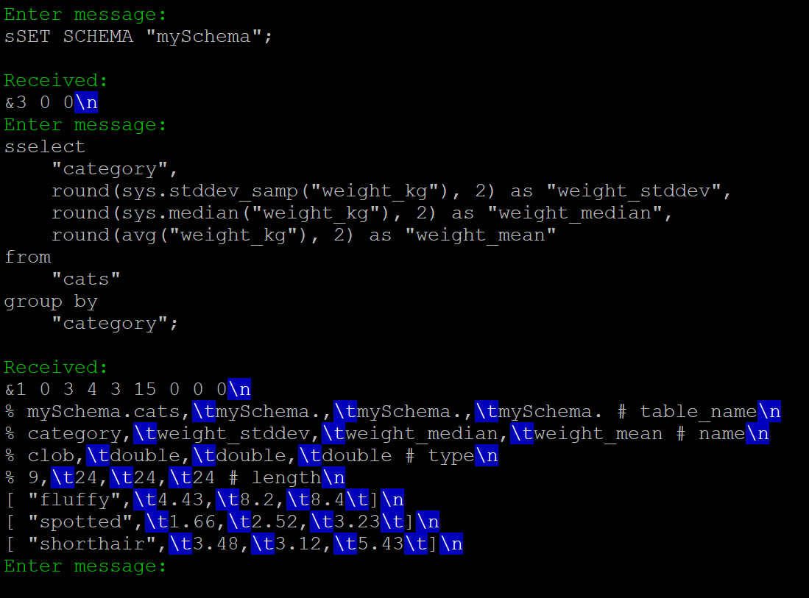

Monet-Explorer
==============

This application helps you to experiment with the [text-based MAPI protocol](https://github.com/MonetDB/MonetDB-PHP/tree/master/protocol_doc)
that is used by client applications to communicate with MonetDB.



# Command line help screen

```
Monet-Explorer

  This application helps you to experiment with the text-based MAPI protocol
  that is used by client applications to communicate with MonetDB.

Example:

 ./monet-explorer -h 127.0.0.1 -u monetdb -p 50000 -P monetdb MyDatabase


Arguments and options:

 --auth-algo, -a algo            The hash algorithm to be used for the 'salted
                                 hashing'. The MonetDB server has to support it.
                                 This is typically a weaker hash algorithm,
                                 which is used together with a stronger 'pass-
                                 word hash' that is now SHA512. The currently
                                 supported values are: SHA1, SHA256, SHA512.

 --file-transfer, -t             Enable the file transfer protocol for the con-
                                 nection.

 --help, -?                      Display the usage instructions.

 --host, -h host_name            The host name or IP address of the MonetDB
                                 server.

 --password, -P password         User password for the database login. The de-
                                 fault value is 'monetdb'.

 --port, -p port                 The port of the MonetDB server.

 --unix-domain-socket, -x        Use a unix domain socket for connecting to the
                                 MonetDB server, instead of connecting through
                                 TCP/IP. If provided, then the host argument is
                                 ignored. The port is still used for finding the
                                 socket file with the proper name in the /tmp
                                 folder.

 --user, -u user_name            User name for the database login.


Positional operands:

 1. database                     The name of the database to connect to.
```

# Build

```
# apt-get install g++ make libssl-dev
```

```
$ make
```
